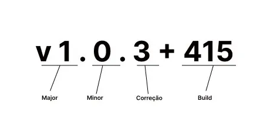

# Padronização na Documentação do GitHub

## Tags



### Numeração
- Major: Refatorou o código? Adicione +1 v2.0.0
- Minor: Adicionou uma nova *feature*? Adicione +1 v2.1.0
- Fez alguma correção? Adicione +1 v2.1.1

### Comandos de tag
- Criando uma tag comentada
```bash
git tag -a v1.0.0 -m "First Release"
```
- Listando todas as tags do repositório
```bash
git tag
```
- *Push* na tag específica
```bash
git push origin v1.0.0
```
- *Push* em todas as tags
```bash
git push origin --tags
```
